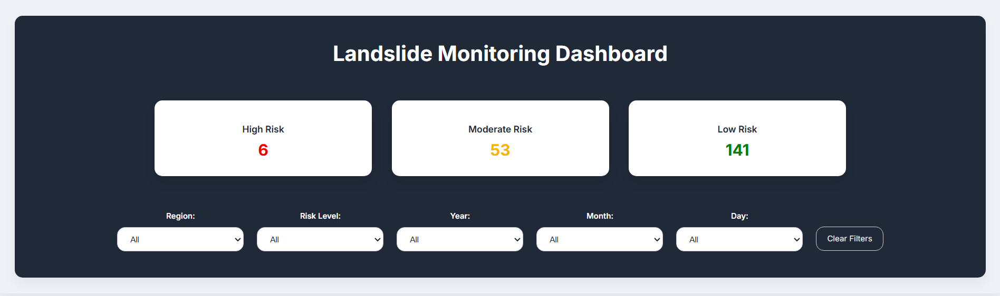
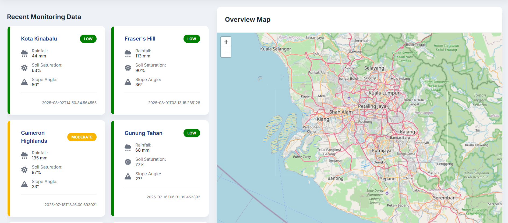
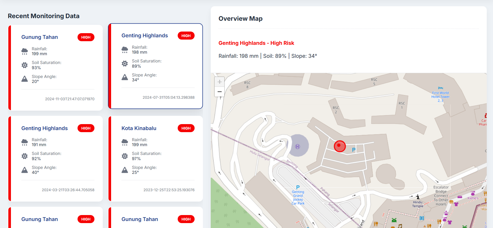

>Landslide Monitoring Dashboard

This project is a real-time dashboard for visualizing and analyzing landslide risk data. It provides an interactive map to pinpoint high-risk areas and a dynamic dashboard to filter and display detailed information on recent landslide events.

>Setup and Architecture

>>Setup Steps
To get this project running on your local machine, you will need to set up both the frontend and the backend.

Prerequisites:
Node.js and npm
Python and pip

1. Backend Setup

-Navigate to the backend directory of project.
-Install the required Python dependencies
-Run the backend server --> python app.py
(The API should now be running on http://127.0.0.1:5000.)

2. Frontend Setup

-Navigate to the frontend directory.
-Install the React project dependencies --> npm install
-Run the frontend server --> npm run dev

>Architecture Summary

The application follows a client-server architecture:

Frontend: A responsive single-page application built with React.js. It uses React Leaflet to render the interactive map and custom components to display filtered landslide data. The UI is designed to be intuitive, with filters for region, risk level, and date.

Backend: A RESTful API built with Python (Flask). It serves landslide risk data from a database or a file, which the frontend fetches via the http://127.0.0.1:5000/api/landslide-risk endpoint.

>Instructions on How to Run and Test

Follow these steps to run the application and test its functionality:

Start the Backend Server: Ensure your backend server is running as described in the setup instructions above. The API must be active for the dashboard to display data.

Start the Frontend: From your frontend directory, run the development server. This will open the application in your default web browser at http://localhost:3000 or http://localhost:5173.

>>Verify Functionality:

Data Loading: The dashboard should automatically load and display recent landslide events in the grid.

Interactive Map: A map of Malaysia with markers should be visible.

Filters: Use the dropdown menus at the top to filter the data by region, risk level, year, month, or day. The grid and the map should update instantly.

Card Interaction: Click on any card in the dashboard. The map will automatically zoom in on that location and highlight the marker.

>Screenshots or Demo Link

